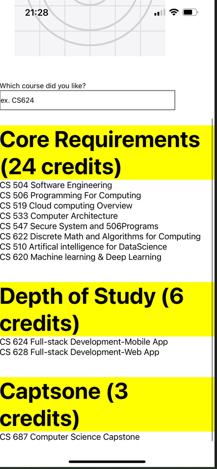

## cs624-pe-sathiyashivani
## PE02-CoreComponents

# Input
In this corecomponents we will display the local image with user requirement and system requirements
User Requirements
o	we can find the “icon.png” under the “./assets” directory.
o	we can enter your favorite course.
o	we display the 8 core, 2 depth of study, and 1 capstone course.

System Requirements
o	we must use an arrow function for the functional component.
o	we must use the core components at least once – View, Text, ScrollView, Image, TextInput, and StyleSheet.
o	our screen is scrollable.
o	By using an internal style, the screen shows some styles.

# Process
We need to download GitHub and sign up. After downloading , we need to click code and wait for codespace to load. After that, we get access to terminal, file explorer and other tools to start working on project. And in terminal we check the version and login the npm and npx and instal expo Command Line Interfere and it is line tool and that is primary interferred between developer and other expo tools. We also download expo in our smartphone. With corecomponents will display the subject and the screen is scrollable. I am using my name as a variable as styles.

# output
We can lively see the changes in our phone and I added my screenshot.

